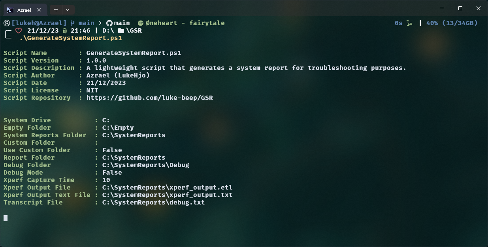

# GSR



A PowerShell script to generate a detailed system report. Ideal for troubleshooting and system analysis, it collects comprehensive information about hardware, software, and network configurations.

### 🚀 Quick Navigation

- [💾 Script Information](#script-information)
- [🛠️ Features](#features)
- [🧠 Usage](#usage)
- [🧰 Variables](#variables)
- [📖 License](#license)
- [📝 Requirements](#requirements)

### Script Information

---

- **Script Name:** GenerateSystemReport.ps1
- **Version:** 1.0.0
- **Date:** 21/12/2023
- **Author:** Azrael (LukeHjo)
- **License:** [MIT License](https://github.com/luke-beep/GSR/blob/main/LICENSE)
- **Repository:** [GitHub](https://github.com/luke-beep/GSR)

### Features

---

- System information: CPU, GPU, memory, disk.
- Network details: configurations, adapters.
- Software inventory: installed programs, services.
- System logs: event, security.
- Customizable report paths and debug options.
- Debug mode for troubleshooting.
- Detailed error handling.
- Easy to use.
- Free and open source.
- No dependencies.
- No installation required.

### Usage

---

Clone the repository using the following command:

```shell
git clone https://github.com/luke-beep/GSR.git
```

Run the script using the following command:

```powershell
.\GenerateSystemReport.ps1
```

### Variables

---

Modify the following variables to customize the script.

| Parameter | Description |
| --- | --- |
| `$customFolder` | The path to save the report. |
| `$useCustomFolder` | Enable the use of a custom folder. |
| `$debugFolder` | The path to save debug logs. |
| `$debug` | Enable debug mode. |

### License

---

This project is licensed under the [MIT License](https://github.com/luke-beep/GSR/blob/main/LICENSE).

### Requirements

---

- PowerShell 5.1 or later.
- Windows NT 10.0 or later.
- Administrator privileges.

---

**<div align="center" id="footer">© 2023 LukeHjo. All rights reserved. <div>**
<br>
<div align="right"><a href="#">(Back to top)</a></div>